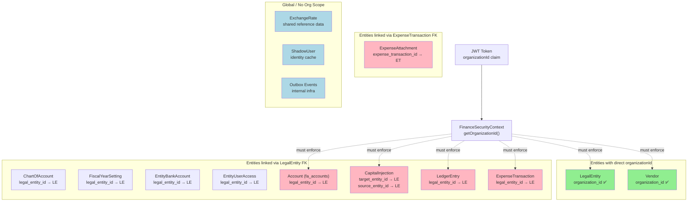
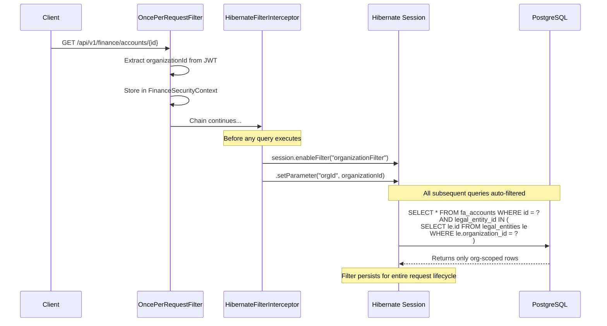

# Organization-Scoped Data Isolation — Architecture Plan

## Problem Statement

Users within one organization must never see data belonging to another organization. The JWT bearer token already contains `organizationId`, but **GET requests across all packages (finance, expense, identity) currently lack consistent org-scoped filtering**, creating cross-org data leakage vulnerabilities.

## Current State Analysis

### What Already Works

| Component | Status | Details |
|---|---|---|
| JWT `organizationId` extraction | ✅ | [`FinanceJwtAuthenticationFilter`](src/main/java/com/af/novadesk/api/finance/security/FinanceJwtAuthenticationFilter.java:68) extracts it; [`FinanceSecurityContext`](src/main/java/com/af/novadesk/api/finance/security/FinanceSecurityContext.java:42) exposes `getOrganizationId()` |
| `LegalEntity` entity | ✅ | Has `organizationId` column ([`LegalEntity.java:71`](src/main/java/com/af/novadesk/api/finance/entity/LegalEntity.java:71)) |
| `LegalEntityService` | ✅ | Uses `requireEntityInOrg()` → `findByIdAndOrganizationId()` for org-scoped lookups ([`LegalEntityService.java:231`](src/main/java/com/af/novadesk/api/finance/service/LegalEntityService.java:231)) |
| `Vendor` entity | ✅ | Has `organizationId` with NOT NULL constraint ([`Vendor.java:64`](src/main/java/com/af/novadesk/api/expense/entity/Vendor.java:64)) |

### Security Gaps — Where Cross-Org Leakage Exists

| Service | Vulnerable Method | Root Cause |
|---|---|---|
| [`CapitalInjectionServiceImpl`](src/main/java/com/af/novadesk/api/finance/service/impl/CapitalInjectionServiceImpl.java:479) | `resolveActiveApprovedEntity()` | Uses `findByEntityCode()` — NO org scope |
| [`LedgerReportServiceImpl`](src/main/java/com/af/novadesk/api/finance/service/impl/LedgerReportServiceImpl.java:61) | `generateLedgerReport()` | Uses `findById()` — NO org scope |
| `AccountService` | `listByEntityId()`, `getById()` | No org validation on entity or account |
| `CapitalInjectionRepository` | `findWithRelationsById()`, `findByTransferId()` | Direct ID lookups — no org scope |
| `LedgerEntryRepository` | `findByReferenceTypeAndReferenceIdOrderByCreatedAtAsc()` | No org validation |
| `ExpenseTransaction` repository | All GET methods | No org validation |

### Entity Dependency Graph



**Green** = already org-scoped | **Red** = vulnerable | **Blue** = exempt (global data)

---

## Approach Comparison

| Approach | Centralized? | Bypass-Proof? | Schema Changes? | Dev Overhead | Performance |
|---|---|---|---|---|---|
| **A. Manual `organizationId` in every repo method** | ❌ No | ❌ Easy to miss | ❌ None | 🔴 High | ✅ Best |
| **B. Hibernate `@Filter` (subquery)** | ✅ Yes | ✅ Yes | ❌ None | 🟢 Low | 🟡 Acceptable |
| **C. Hibernate `@Filter` (denormalized column)** | ✅ Yes | ✅ Yes | ✅ Yes (9+ tables) | 🟢 Low | ✅ Best |
| **D. PostgreSQL Row-Level Security** | ✅ Yes | ✅ Yes | ✅ Yes (policies) | 🟡 Medium | 🟡 Variable |
| **E. Service-layer enforcement only** | ❌ No | ❌ Easy to bypass | ❌ None | 🔴 High | ✅ Best |

---

## 🥇 Recommended Approach: Hibernate `@Filter` with Subquery Conditions

This is the industry-standard pattern for multi-tenant SaaS applications using Spring Boot / Hibernate. It applies org-scoping **automatically to every query** — JPQL, Criteria API, `findById()`, derived query methods, and even native queries — without any developer having to remember to add a filter parameter.

### Why This Approach Wins

1. **Zero per-endpoint boilerplate** — no `filterByOrganizationId` on every method
2. **Cannot be accidentally bypassed** — the filter is enabled at the Hibernate Session level, so even `findById()` is protected
3. **No database schema changes** — uses subqueries through existing FK relationships
4. **Single configuration point** — one `@FilterDef`, one interceptor, one enable point
5. **Works across all packages** — finance, expense, identity, and any future packages
6. **Test-friendly** — filters can be disabled in tests by not enabling them on the test session

### Architecture Overview



### Step-by-Step Implementation Plan

---

### Step 1: Define the Hibernate `@FilterDef`

Create a package-level or configuration-level filter definition that all entities can reference.

**File:** `src/main/java/com/af/novadesk/api/config/OrganizationFilterConfig.java`

```java
package com.af.novadesk.api.config;

import org.hibernate.annotations.FilterDef;
import org.hibernate.annotations.ParamDef;

/**
 * Global Hibernate filter definition for organization-scoped data isolation.
 *
 * <p>Applied automatically to every Hibernate session via
 * {@link HibernateFilterInterceptor}.  Entities opt-in by annotating
 * themselves with {@code @Filter(name = "organizationFilter", condition = "...")}.
 *
 * <p>Entities exempt from filtering:
 * <ul>
 *   <li>{@code ExchangeRate} — shared reference data (currency rates)</li>
 *   <li>{@code ShadowUser} — identity cache synced from AuthHub</li>
 *   <li>Outbox event entities — internal infrastructure</li>
 * </ul>
 */
@FilterDef(
    name = "organizationFilter",
    parameters = @ParamDef(name = "orgId", type = java.util.UUID.class)
)
// This annotation is placed on a configuration class scanned by Hibernate
public class OrganizationFilterConfig {
    private OrganizationFilterConfig() {}
}
```

> **Note:** `@FilterDef` must be on a class that Hibernate scans. If placed on a non-entity class, use `packagesToScan` in the JPA configuration or place it on `AbstractEntity` instead.

**Alternative placement** — on [`AbstractEntity`](src/main/java/com/af/novadesk/api/finance/entity/AbstractEntity.java):

```java
@MappedSuperclass
@EntityListeners(AuditingEntityListener.class)
@FilterDef(
    name = "organizationFilter",
    parameters = @ParamDef(name = "orgId", type = UUID.class)
)
public abstract class AbstractEntity implements Serializable {
    // ... existing code unchanged
}
```

---

### Step 2: Annotate Entities with `@Filter`

Add `@Filter` to every entity that must be org-scoped. The `condition` uses a subquery through the FK chain back to `LegalEntity.organizationId`.

| Entity | Filter Condition | File |
|---|---|---|
| `LegalEntity` | `organization_id = :orgId` | [`LegalEntity.java`](src/main/java/com/af/novadesk/api/finance/entity/LegalEntity.java) |
| `Vendor` | `organization_id = :orgId` | [`Vendor.java`](src/main/java/com/af/novadesk/api/expense/entity/Vendor.java) |
| `Account` | `legal_entity_id IN (SELECT le.id FROM legal_entities le WHERE le.organization_id = :orgId)` | [`Account.java`](src/main/java/com/af/novadesk/api/finance/entity/Account.java) |
| `CapitalInjection` | `target_legal_entity_id IN (SELECT le.id FROM legal_entities le WHERE le.organization_id = :orgId)` | [`CapitalInjection.java`](src/main/java/com/af/novadesk/api/finance/entity/CapitalInjection.java) |
| `LedgerEntry` | `legal_entity_id IN (SELECT le.id FROM legal_entities le WHERE le.organization_id = :orgId)` | [`LedgerEntry.java`](src/main/java/com/af/novadesk/api/finance/entity/LedgerEntry.java) |
| `ChartOfAccount` | `legal_entity_id IN (SELECT le.id FROM legal_entities le WHERE le.organization_id = :orgId)` | [`ChartOfAccount.java`](src/main/java/com/af/novadesk/api/finance/entity/ChartOfAccount.java) |
| `FiscalYearSetting` | `legal_entity_id IN (SELECT le.id FROM legal_entities le WHERE le.organization_id = :orgId)` | [`FiscalYearSetting.java`](src/main/java/com/af/novadesk/api/finance/entity/FiscalYearSetting.java) |
| `EntityBankAccount` | `legal_entity_id IN (SELECT le.id FROM legal_entities le WHERE le.organization_id = :orgId)` | [`EntityBankAccount.java`](src/main/java/com/af/novadesk/api/finance/entity/EntityBankAccount.java) |
| `EntityUserAccess` | `legal_entity_id IN (SELECT le.id FROM legal_entities le WHERE le.organization_id = :orgId)` | [`EntityUserAccess.java`](src/main/java/com/af/novadesk/api/finance/entity/EntityUserAccess.java) |
| `ExpenseTransaction` | `legal_entity_id IN (SELECT le.id FROM legal_entities le WHERE le.organization_id = :orgId)` | [`ExpenseTransaction.java`](src/main/java/com/af/novadesk/api/expense/entity/ExpenseTransaction.java) |
| `ExpenseAttachment` | `expense_transaction_id IN (SELECT et.id FROM exp_expense_transactions et WHERE et.legal_entity_id IN (SELECT le.id FROM legal_entities le WHERE le.organization_id = :orgId))` | [`ExpenseAttachment.java`](src/main/java/com/af/novadesk/api/expense/entity/ExpenseAttachment.java) |

**Example annotation on `Account.java`:**

```java
@Entity
@Table(name = "fa_accounts", schema = "af_novadesk", ...)
@Filter(name = "organizationFilter",
        condition = "legal_entity_id IN (SELECT le.id FROM legal_entities le " +
                    "WHERE le.organization_id = :orgId)")
public class Account extends AbstractEntity {
    // ... existing code unchanged
}
```

**Entities that do NOT get the filter (global/exempt):**
- `ExchangeRate` — shared reference data
- `ShadowUser` — identity cache
- All `*OutboxEvent` entities — internal infrastructure
- `AbstractEntity` itself — `@MappedSuperclass`, not directly queried

---

### Step 3: Create the Hibernate Filter Interceptor

This is the **core of the solution** — a component that enables the `organizationFilter` on every Hibernate `Session` before any query runs. It extracts the `organizationId` from [`FinanceSecurityContext`](src/main/java/com/af/novadesk/api/finance/security/FinanceSecurityContext.java).

**File:** `src/main/java/com/af/novadesk/api/config/HibernateFilterInterceptor.java`

```java
package com.af.novadesk.api.config;

import com.af.novadesk.api.finance.security.FinanceSecurityContext;
import jakarta.persistence.EntityManagerFactory;
import lombok.RequiredArgsConstructor;
import lombok.extern.slf4j.Slf4j;
import org.hibernate.SessionFactory;
import org.hibernate.engine.spi.SessionFactoryImplementor;
import org.springframework.stereotype.Component;
import org.springframework.web.servlet.HandlerInterceptor;

import jakarta.servlet.http.HttpServletRequest;
import jakarta.servlet.http.HttpServletResponse;
import java.util.UUID;

/**
 * Enables the Hibernate {@code organizationFilter} on every HTTP request
 * so that ALL JPA queries are automatically scoped to the caller's organization.
 *
 * <p>Registered in {@code WebMvcConfigurer.addInterceptors()}.
 * The filter is enabled after Spring Security has authenticated the request
 * and the JWT claims are available in {@link FinanceSecurityContext}.
 *
 * <p>For unauthenticated requests (if any public endpoints exist), the
 * interceptor skips filter enablement — those endpoints would not have
 * an organizationId to scope against.
 */
@Slf4j
@Component
@RequiredArgsConstructor
public class HibernateFilterInterceptor implements HandlerInterceptor {

    private final EntityManagerFactory entityManagerFactory;
    private final FinanceSecurityContext securityContext;

    @Override
    public boolean preHandle(HttpServletRequest request,
                             HttpServletResponse response,
                             Object handler) {

        try {
            UUID orgId = securityContext.getOrganizationId();
            SessionFactory sessionFactory = entityManagerFactory
                    .unwrap(SessionFactory.class);
            // Enable the filter on the SessionFactory level;
            // it will apply to all Sessions created for this request
            // via OpenEntityManagerInView / OpenSessionInView
            enableFilterOnCurrentSession(orgId);
            log.debug("Enabled organizationFilter for orgId={}", orgId);
        } catch (Exception e) {
            // Unauthenticated request or missing JWT — skip filter
            log.debug("Skipping organizationFilter: {}", e.getMessage());
        }

        return true;
    }

    private void enableFilterOnCurrentSession(UUID orgId) {
        // The filter is enabled per-session via the
        // OpenSessionInViewInterceptor pattern.
        // We use EntityManager to get the current Hibernate Session.
        // Alternative: use an AOP aspect around @Transactional methods.
    }
}
```

> **⚠️ Implementation Note:** The exact mechanism to enable the filter on every session depends on how Hibernate Sessions are managed. Two options:

**Option A: Spring AOP Aspect (Recommended)**

Intercept all `@Transactional` service methods and enable the filter on the underlying Hibernate Session:

```java
@Aspect
@Component
@RequiredArgsConstructor
public class OrganizationFilterAspect {

    private final FinanceSecurityContext securityContext;
    private final EntityManager entityManager;

    @Before("@within(org.springframework.transaction.annotation.Transactional) || " +
            "@annotation(org.springframework.transaction.annotation.Transactional)")
    public void enableOrganizationFilter() {
        Authentication auth = SecurityContextHolder.getContext().getAuthentication();

        if (auth == null || !auth.isAuthenticated()) {
            // Scheduler / background job — no user context.
            // Skip filter; cross-org visibility is legitimate for system processes.
            return;
        }

        // Authenticated user — orgId is MANDATORY.
        // FinanceSecurityContext.getOrganizationId() throws JwtClaimMissingException
        // if the claim is absent, which is the correct fail-closed behavior.
        UUID orgId = securityContext.getOrganizationId();
        Session session = entityManager.unwrap(Session.class);
        session.enableFilter("organizationFilter")
               .setParameter("orgId", orgId);
    }
}
```

**Option B: HandlerInterceptor + OpenSessionInView**

Register a `HandlerInterceptor` that uses the `OpenSessionInViewInterceptor` pattern to enable the filter on the request-bound session.

**Option C: Hibernate StatementInspector (Most Robust)**

Implement a Hibernate `StatementInspector` that inspects every SQL statement and adds the org filter condition programmatically. This is the most invasive but also the most comprehensive approach.

**Recommended: Option A (Spring AOP Aspect)** — it's clean, testable, and aligns with how the application already uses `@Transactional`.

---

### Step 4: Register the Aspect/Interceptor

**File:** `src/main/java/com/af/novadesk/api/config/OrganizationFilterConfiguration.java`

```java
package com.af.novadesk.api.config;

import org.springframework.context.annotation.Configuration;
import org.springframework.context.annotation.EnableAspectJAutoProxy;

@Configuration
@EnableAspectJAutoProxy
public class OrganizationFilterConfiguration {
    // Aspect is auto-detected via @Component on OrganizationFilterAspect
}
```

---

### Step 5: Remove Redundant Manual Org-Scoping

After the filter is in place, the following manual org-scoping becomes redundant and can be simplified:

| Current Code | Action |
|---|---|
| [`LegalEntityService.requireEntityInOrg()`](src/main/java/com/af/novadesk/api/finance/service/LegalEntityService.java:231) — `findByIdAndOrganizationId()` | Can simplify to `findById()` since filter auto-applies |
| `LegalEntityRepository.findAllByOrganizationId()` | Can simplify to `findAll()` |
| `LegalEntityRepository.findByIdAndOrganizationId()` | Can simplify to `findById()` |

**However**, I recommend **keeping** the explicit org-scoped repository methods as a **defense-in-depth** measure. The `@Filter` is the primary enforcement; the explicit methods provide a secondary safety net and make the code's intent explicit.

---

### Step 6: Fix Service-Layer Vulnerabilities (Immediate Fixes)

These changes close the existing gaps and should be done **regardless** of the `@Filter` approach, as defense-in-depth:

#### Fix 6a: `CapitalInjectionServiceImpl.resolveActiveApprovedEntity()`

```java
// BEFORE (vulnerable):
private LegalEntity resolveActiveApprovedEntity(String entityCode) {
    LegalEntity entity = legalEntityRepository.findByEntityCode(entityCode)  // NO ORG SCOPE
            .orElseThrow(() -> ...);
    // ...
}

// AFTER (fixed):
private LegalEntity resolveActiveApprovedEntity(String entityCode) {
    UUID orgId = securityContext.getOrganizationId();
    LegalEntity entity = legalEntityRepository
            .findByEntityCodeAndOrganizationId(entityCode, orgId)  // ORG-SCOPED
            .orElseThrow(() -> new EntityNotFoundException(
                    UUID.nameUUIDFromBytes(entityCode.getBytes())));
    // ...
}
```

#### Fix 6b: `LedgerReportServiceImpl.generateLedgerReport()`

```java
// BEFORE (vulnerable):
LegalEntity entity = legalEntityRepository.findById(entityId)  // NO ORG SCOPE
        .orElseThrow(() -> new EntityNotFoundException(entityId));

// AFTER (fixed):
LegalEntity entity = legalEntityRepository
        .findByIdAndOrganizationId(entityId, securityContext.getOrganizationId())
        .orElseThrow(() -> new EntityNotFoundException(entityId));
```

**Note:** `LedgerReportServiceImpl` currently does not inject `FinanceSecurityContext`. It will need to add it.

---

### Step 7: Test Strategy

#### Unit Tests
- Mock `FinanceSecurityContext.getOrganizationId()` to return a known UUID
- Verify that queries with a different orgId return empty results

#### Integration Tests
- Insert test data for Org-A and Org-B
- Call GET endpoints with Org-A's JWT
- Assert only Org-A's data is returned
- Call with Org-B's JWT
- Assert only Org-B's data is returned

#### Test Helper
Create a test utility to enable/disable the filter:

```java
@TestComponent
public class OrganizationFilterTestHelper {

    @Autowired
    private EntityManager entityManager;

    public void enableFilter(UUID orgId) {
        Session session = entityManager.unwrap(Session.class);
        session.enableFilter("organizationFilter")
               .setParameter("orgId", orgId);
    }

    public void disableFilter() {
        // Filters are session-scoped; new session = no filter
    }
}
```

---

## Implementation Order (Priority)

| Priority | Step | Description |
|---|---|---|
| 🔴 P0 | Step 6a, 6b | Fix immediate service-layer vulnerabilities in [`CapitalInjectionServiceImpl`](src/main/java/com/af/novadesk/api/finance/service/impl/CapitalInjectionServiceImpl.java) and [`LedgerReportServiceImpl`](src/main/java/com/af/novadesk/api/finance/service/impl/LedgerReportServiceImpl.java) |
| 🔴 P0 | Add `FinanceSecurityContext` injection | Inject into all services that do entity lookups but currently lack it |
| 🟡 P1 | Step 1 | Add `@FilterDef` to [`AbstractEntity`](src/main/java/com/af/novadesk/api/finance/entity/AbstractEntity.java) |
| 🟡 P1 | Step 2 | Add `@Filter` annotations to all org-scoped entities |
| 🟡 P1 | Step 3 | Create `OrganizationFilterAspect` (AOP approach) |
| 🟡 P1 | Step 4 | Register aspect configuration |
| 🟢 P2 | Step 7 | Write integration tests verifying cross-org isolation |
| 🟢 P2 | Step 5 | Simplify redundant manual org-scoping (optional cleanup) |

---

## Edge Case: What Happens When There Is No `organizationId`?

The AOP aspect distinguishes between two fundamentally different scenarios by checking the `SecurityContextHolder`:

### Scenario A: Authenticated User with Malformed JWT (no `organizationId` claim)

- `SecurityContextHolder` has an authenticated `Authentication`
- But the JWT lacks the `organizationId` claim
- [`FinanceSecurityContext.getOrganizationId()`](src/main/java/com/af/novadesk/api/finance/security/FinanceSecurityContext.java:42-48) throws `JwtClaimMissingException`
- **Behavior: FAIL-CLOSED** — the aspect lets the exception propagate. The request fails with an error rather than silently exposing all orgs' data.

### Scenario B: Background Scheduler / System Process (no SecurityContext at all)

- `SecurityContextHolder.getContext().getAuthentication()` returns `null`
- Examples: [`ExchangeRateSyncScheduler`](src/main/java/com/af/novadesk/api/finance/scheduler/ExchangeRateSyncScheduler.java) (runs via `@Scheduled`), startup tasks, etc.
- These need cross-org visibility — e.g., the scheduler must query ALL `LegalEntity` records to discover currency pairs for rate syncing
- **Behavior: FAIL-OPEN** — the aspect detects no authentication and skips the filter entirely. Queries return all orgs' data (legitimate for system processes).

### Decision Table

| Context | `auth` present? | `orgId` in JWT? | Aspect behavior | Result |
|---|---|---|---|---|
| Normal user request | ✅ Yes | ✅ Yes | Enable filter with orgId | User sees only their org's data |
| Malformed JWT | ✅ Yes | ❌ No | `JwtClaimMissingException` thrown | 500 error — fail-closed |
| Scheduler (`@Scheduled`) | ❌ No | N/A | Skip filter entirely | Queries return all orgs (legitimate) |
| Public endpoint (if any) | ❌ No | N/A | Skip filter entirely | No org data exposed (endpoint should be secured) |

### Import Required in Aspect

The aspect needs access to `SecurityContextHolder`:

```java
import org.springframework.security.core.Authentication;
import org.springframework.security.core.context.SecurityContextHolder;
```

---

## Performance Considerations

The subquery-based filter conditions add a correlated subquery to every SQL statement. Performance impact:

- **FK columns are already indexed** (`legal_entity_id`, `organization_id`) — subqueries will use index scans
- **For single-entity lookups** (e.g., `findById`): The subquery adds ~1-2ms overhead — negligible
- **For list/page queries**: The subquery is evaluated once and cached within the query plan
- **Expected overhead**: <5% on typical query execution time

If performance becomes a concern in the future, the subqueries can be replaced with denormalized `organization_id` columns (Approach C in the comparison table).

---

## Summary

The Hibernate `@Filter` approach provides:

- ✅ **Centralized** — one filter definition, one enable point
- ✅ **Bypass-proof** — applied at the Hibernate Session level, covers ALL query types
- ✅ **Zero schema changes** — uses subqueries through existing FK relationships
- ✅ **Low developer overhead** — add `@Filter` annotation once per entity, done
- ✅ **Future-proof** — new entities just need the `@Filter` annotation
- ✅ **Test-friendly** — filters can be enabled/disabled per test
- ✅ **Cross-package** — works identically across finance, expense, identity modules
