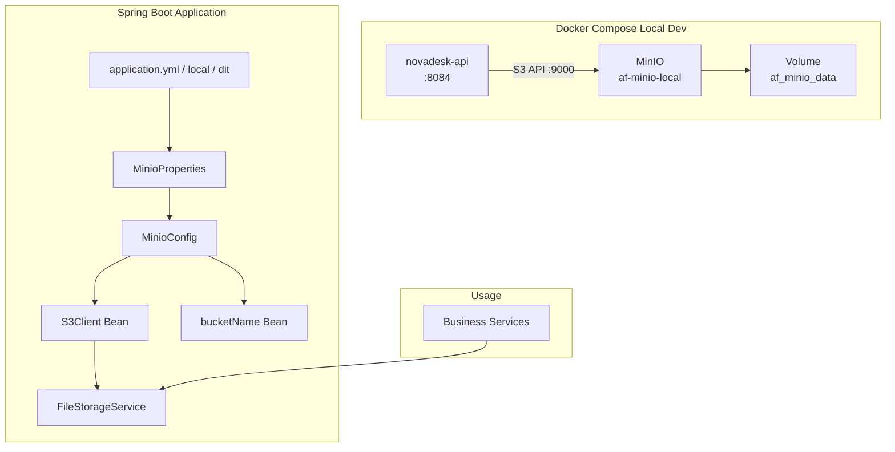

# Plan: Add MinIO Object Storage Support to NovaDesk API

## Overview

Add MinIO (S3-compatible object storage) as a local development dependency and configure the Spring Boot application to connect to it across all environments (local, dit, sit, prod).

---

## Files to Create

### 1. [`src/main/java/com/af/novadesk/api/config/MinioProperties.java`](src/main/java/com/af/novadesk/api/config/MinioProperties.java)

Configuration properties record binding to `app.minio.*` prefix.

```java
package com.af.novadesk.api.config;

import org.springframework.boot.context.properties.ConfigurationProperties;

@ConfigurationProperties(prefix = "app.minio")
public record MinioProperties(
    String url,
    String accessKey,
    String secretKey,
    String bucket,
    String region
) {}
```

### 2. [`src/main/java/com/af/novadesk/api/config/MinioConfig.java`](src/main/java/com/af/novadesk/api/config/MinioConfig.java)

Spring `@Configuration` class that:
- Creates an `S3Client` bean pointed at the MinIO server (using `MinioProperties`)
- Creates a `String` bean for the bucket name
- On startup, ensures the bucket exists (creates it if missing)

```java
package com.af.novadesk.api.config;

import org.springframework.boot.context.properties.EnableConfigurationProperties;
import org.springframework.context.annotation.Bean;
import org.springframework.context.annotation.Configuration;
import software.amazon.awssdk.auth.credentials.AwsBasicCredentials;
import software.amazon.awssdk.auth.credentials.StaticCredentialsProvider;
import software.amazon.awssdk.regions.Region;
import software.amazon.awssdk.services.s3.S3Client;
import software.amazon.awssdk.services.s3.S3Configuration;
import software.amazon.awssdk.services.s3.model.CreateBucketRequest;
import software.amazon.awssdk.services.s3.model.HeadBucketRequest;
import software.amazon.awssdk.services.s3.model.S3Exception;
import java.net.URI;

@Configuration
@EnableConfigurationProperties(MinioProperties.class)
public class MinioConfig {

    @Bean
    public S3Client s3Client(MinioProperties props) {
        return S3Client.builder()
            .endpointOverride(URI.create(props.url()))
            .credentialsProvider(
                StaticCredentialsProvider.create(
                    AwsBasicCredentials.create(props.accessKey(), props.secretKey())
                )
            )
            .region(Region.of(props.region()))
            .serviceConfiguration(S3Configuration.builder()
                .pathStyleAccessEnabled(true)
                .build())
            .build();
    }

    @Bean
    public String minioBucketName(MinioProperties props) {
        return props.bucket();
    }

    @Bean
    public boolean ensureBucketExists(S3Client s3Client, MinioProperties props) {
        try {
            s3Client.headBucket(HeadBucketRequest.builder()
                .bucket(props.bucket())
                .build());
        } catch (S3Exception e) {
            if (e.statusCode() == 404) {
                s3Client.createBucket(CreateBucketRequest.builder()
                    .bucket(props.bucket())
                    .build());
            }
        }
        return true;
    }
}
```

### 3. [`src/main/java/com/af/novadesk/api/common/service/FileStorageService.java`](src/main/java/com/af/novadesk/api/common/service/FileStorageService.java)

Service abstraction for file operations using S3Client.

```java
package com.af.novadesk.api.common.service;

import org.springframework.stereotype.Service;
import software.amazon.awssdk.core.sync.RequestBody;
import software.amazon.awssdk.services.s3.S3Client;
import software.amazon.awssdk.services.s3.model.*;
import java.io.InputStream;
import java.util.List;

@Service
public class FileStorageService {

    private final S3Client s3Client;
    private final String bucketName;

    public FileStorageService(S3Client s3Client, String minioBucketName) {
        this.s3Client = s3Client;
        this.bucketName = minioBucketName;
    }

    public PutObjectResponse upload(String key, byte[] data, String contentType) {
        return s3Client.putObject(PutObjectRequest.builder()
                .bucket(bucketName)
                .key(key)
                .contentType(contentType)
                .build(),
            RequestBody.fromBytes(data));
    }

    public GetObjectResponse download(String key, OutputStream outputStream) {
        // Implementation for download
    }

    public DeleteObjectResponse delete(String key) {
        return s3Client.deleteObject(DeleteObjectRequest.builder()
            .bucket(bucketName)
            .key(key)
            .build());
    }

    public ListObjectsV2Response list(String prefix) {
        return s3Client.listObjectsV2(ListObjectsV2Request.builder()
            .bucket(bucketName)
            .prefix(prefix)
            .build());
    }
}
```

---

## Files to Modify

### 4. [`docker-compose.yml`](docker-compose.yml)

Add the MinIO service and a dedicated named volume.

```yaml
services:
  # ... existing novadesk-api service ...

  minio:
    image: quay.io/minio/minio
    container_name: af-minio-local
    command: server /data --console-address ":9001"
    environment:
      MINIO_ROOT_USER: af_minio
      MINIO_ROOT_PASSWORD: af_minio_password
    ports:
      - "9000:9000"
      - "9001:9001"
    volumes:
      - af_minio_data:/data
    healthcheck:
      test: ["CMD", "curl", "-f", "http://localhost:9000/minio/health/live"]
      interval: 10s
      timeout: 5s
      retries: 5

volumes:
  af_minio_data:
```

### 5. [`pom.xml`](pom.xml)

Add the AWS S3 SDK dependency (inside `<dependencies>`):

```xml
<!-- MinIO / S3 Object Storage -->
<dependency>
    <groupId>software.amazon.awssdk</groupId>
    <artifactId>s3</artifactId>
    <version>2.29.0</version>
</dependency>
```

### 6. [`src/main/resources/application.yml`](src/main/resources/application.yml)

Add MinIO properties under `app:` section (uses env vars, for server environments):

```yaml
app:
  # ... existing app config ...

  minio:
    url: ${MINIO_URL}
    access-key: ${MINIO_ACCESS_KEY}
    secret-key: ${MINIO_SECRET_KEY}
    bucket: ${MINIO_BUCKET:af-novadesk}
    region: ${MINIO_REGION:us-east-1}
```

### 7. [`src/main/resources/application-local.yml`](src/main/resources/application-local.yml)

Add MinIO properties with local defaults:

```yaml
app:
  # ... existing app config ...

  minio:
    url: http://localhost:9000
    access-key: af_minio
    secret-key: af_minio_password
    bucket: af-novadesk
    region: us-east-1
```

### 8. [`src/main/resources/application-dit.yml`](src/main/resources/application-dit.yml)

Add MinIO properties (uses env vars, same pattern as application.yml):

```yaml
app:
  minio:
    url: ${MINIO_URL}
    access-key: ${MINIO_ACCESS_KEY}
    secret-key: ${MINIO_SECRET_KEY}
    bucket: ${MINIO_BUCKET:af-novadesk}
    region: ${MINIO_REGION:us-east-1}
```

---

## Architecture Diagram



---

## Execution Order

| # | Step | File(s) | Type |
|---|------|---------|------|
| 1 | Add MinIO service + volume to docker-compose.yml | [`docker-compose.yml`](docker-compose.yml) | Modify |
| 2 | Add AWS S3 SDK dependency to pom.xml | [`pom.xml`](pom.xml) | Modify |
| 3 | Create MinioProperties record | [`src/main/java/com/af/novadesk/api/config/MinioProperties.java`](src/main/java/com/af/novadesk/api/config/MinioProperties.java) | Create |
| 4 | Create MinioConfig with S3Client bean + bucket init | [`src/main/java/com/af/novadesk/api/config/MinioConfig.java`](src/main/java/com/af/novadesk/api/config/MinioConfig.java) | Create |
| 5 | Create FileStorageService | [`src/main/java/com/af/novadesk/api/common/service/FileStorageService.java`](src/main/java/com/af/novadesk/api/common/service/FileStorageService.java) | Create |
| 6 | Add MinIO properties to application.yml | [`src/main/resources/application.yml`](src/main/resources/application.yml) | Modify |
| 7 | Add MinIO properties to application-local.yml | [`src/main/resources/application-local.yml`](src/main/resources/application-local.yml) | Modify |
| 8 | Add MinIO properties to application-dit.yml | [`src/main/resources/application-dit.yml`](src/main/resources/application-dit.yml) | Modify |
